# 우리 게임 — 목록 · 훅 게임 · 디자인 시안

우리가 만들었거나 만들고 있는 게임을 한곳에 모은 스냅샷입니다. 로직을 새 게임에 옮길 때 "이미 해본 것"을 먼저 찾는 용도입니다.

- 기준일: **2026-10-09** (내부 design_lab 허브 기록 기준). 상태는 이후 바뀔 수 있습니다.
- `sim n/n` = 각 MVP의 헤드리스 규칙 시뮬레이션 통과 수. 실제 기기·플레이어 검증과는 별개입니다.
- 출시 일정·수익·계정 정보는 이 저장소(공개)에 두지 않습니다.

## 1. 훅 게임

검증된 훅만 골라 상업용으로 다시 짠 라인입니다. 출처는 아래 2절의 MVP들입니다.

| | 이름 | 핵심 규칙 | 상태 |
|---|---|---|---|
| 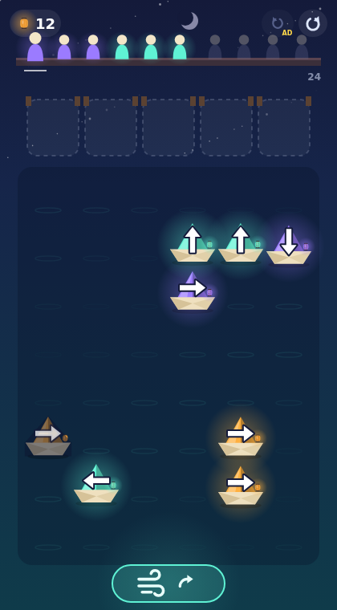 | **A 등불 항구** Lantern Harbor | 화살표 방향 해제 퍼즐(6×8, 정박지 5) + **바람 카드**: 레벨당 한 번, 남은 화살표가 전부 시계 방향 90° 회전. 60판 모두 풀 수 있고, 39판은 바람 없이는 못 풂 | 웹 MVP v1 · sim 29/29 |
| 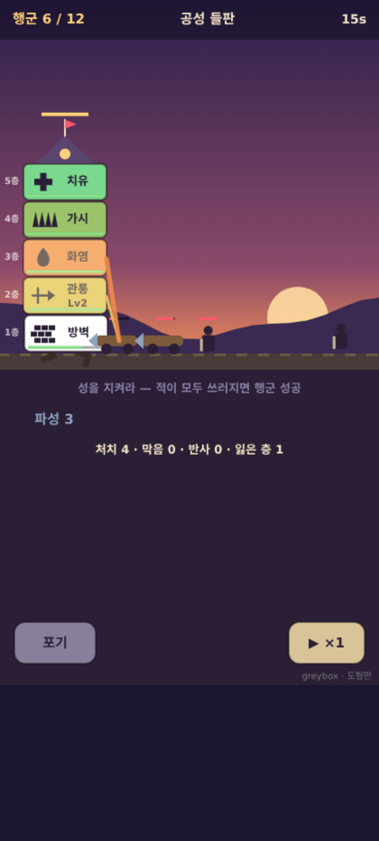 | **B 걷는 성** Wandering Keep | 층 순서 퍼즐 TD. 적 특성 5종과 카운터가 각자 높이 대역에 묶임(비행↔궁수 3층 이상, 떼↔화염 3층 이하, 굴착↔가시 1층…). 대역이 겹쳐서 층 순서가 곧 퍼즐 | 도형 그레이박스 · sim 36/36 |
| | **C 픽셀 피크닉** | 시안 단계 | 빌드 안 함 |

**2026-10 신규 시안** (플랫폼당 2안)

| 안 | 플랫폼 · 장르 | 한 줄 훅 | 상태 |
|---|---|---|---|
| A1 오행 정리 | 앱 · 하이브리드 캐주얼 퍼즐 | 다섯 블롭을 상생 순서로 꽂으면 한 줄이 통째로 사라지고, 상극 옆에 두면 칸이 잠긴다 | 후보 |
| A2 밤의 점집 | 앱 · 프리미엄 이상현상 · 16+ | 낮엔 사주 상담, 밤엔 손님이 이상하다. "틀린 하나"를 찾아 돌려보내지 못하면 아침이 오지 않는다 | 후보 |
| **R-A 이상현상 점집: 야간 근무** | Roblox · 호러 교대 근무 · 1~4인 | 손님 중 하나는 사람이 아니다. 복채를 받기 전에 걸러내라 | **선택됨 (10-09)** · 손님 3D · 게임 화면 v2 · 점 보기 기획서 v1 → [`anomaly_shop/`](anomaly_shop/README.md) |
| R-B 걷는 성: 네 명의 층 | Roblox · 협동 TD | 훅 게임 B를 협동판으로. 플레이어마다 층 하나 | 후보 |

## 2. 게임 MVP 22종 (웹, 도형 그래픽)

인기 게임의 핵심 로직을 도형만으로 다시 만든 웹 MVP, 그리고 자체 게임입니다. "로직 출처" 열이 분석한 원본 게임입니다.

| # | 미리보기 | 이름 | 로직 출처 | 장르 | sim |
|---|---|---|---|---|---|
| 1 | 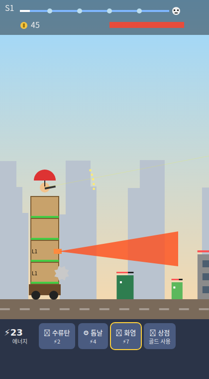 | 로직 연구 #1 | TDS - Tower Destiny Survive (SayGames) | 타워 러너 · 샷건 조준 | 21/21 |
| 2 | 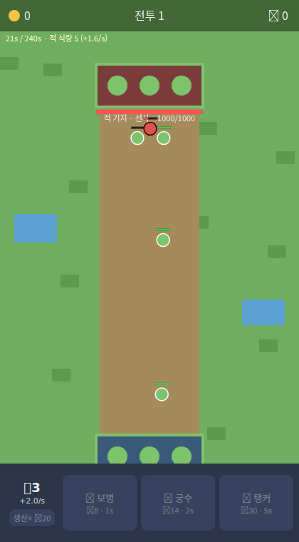 | 로직 연구 #2 | Eternal Empire (Nature Games · We Are Warriors! 장르) | 레인 거점전 · 시대 진화 | 35/35 |
| 3 | 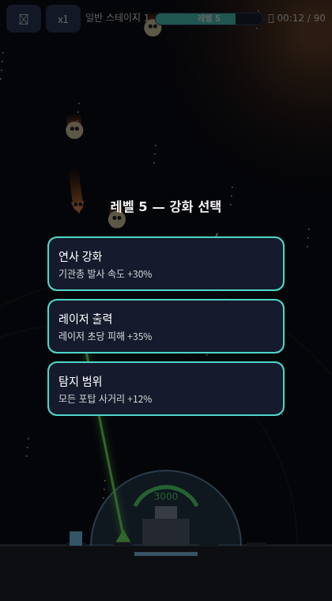 | 로직 연구 #3 | Galaxy Defense (CyberJoy Games) | 자동 포탑 방어 · 3택1 카드 | 38/38 |
| 4 | 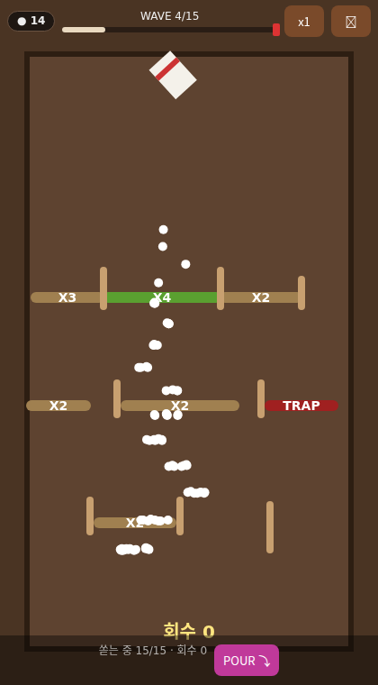 | 로직 연구 #4 | Cup Heroes (VOODOO) | 자동 전투 · 컵 물리 증식 | 51/51 |
| 5 | 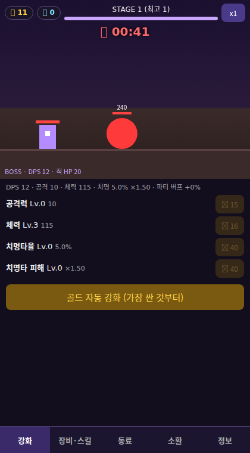 | 로직 연구 #5 | 나 혼자 만렙 키우기 (웹툰 IP 방치형 핵앤슬래시 RPG) | 방치형 RPG · 소환 가차 | 55/55 |
| 6 | 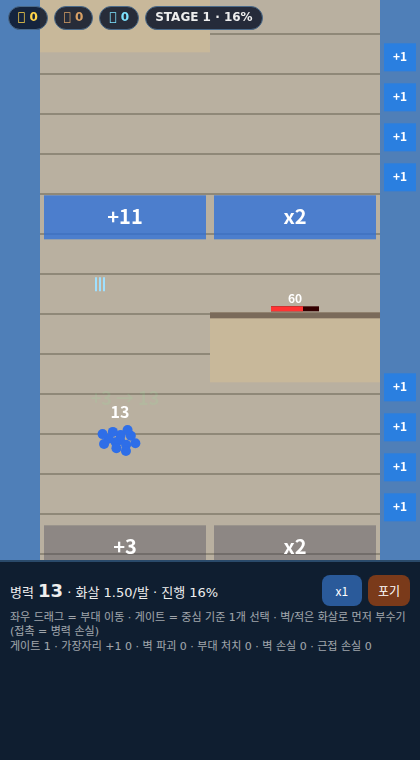 | 로직 연구 #6 | 탑 로드 Top Lords (GAME SPARK · 러너 유입 + SLG) | 드래그 러너 · 영지 SLG | 60/60 |
| 7 | 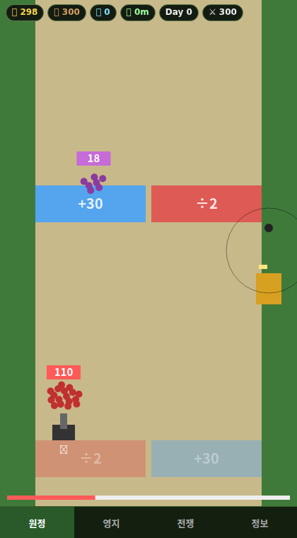 | 로직 연구 #7 | Kingshot (Century Games · 광고 훅 + 4X SLG + 집결 BM) | 광고 훅 원정 · 4X 영지 · 집결전 | 62/62 |
| 8 |  | snake_survivor (own game, Godot) — reference | 자체 (Snake × Survivors-like, 2026-08) | 동료 열차 서바이벌 → 원정 메타 | 16/16 headless (card12) |
| 9 | 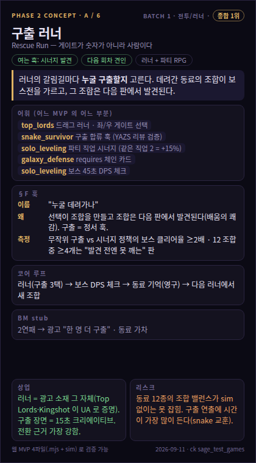 | Phase 2 구상안 A–F — 참고 카드 6장 + 시연 화면 6장 | 자체 구상 (Sage 2026-09-11, Hun 요청) | 구상안 · 참고 카드 |  |
| 10 | 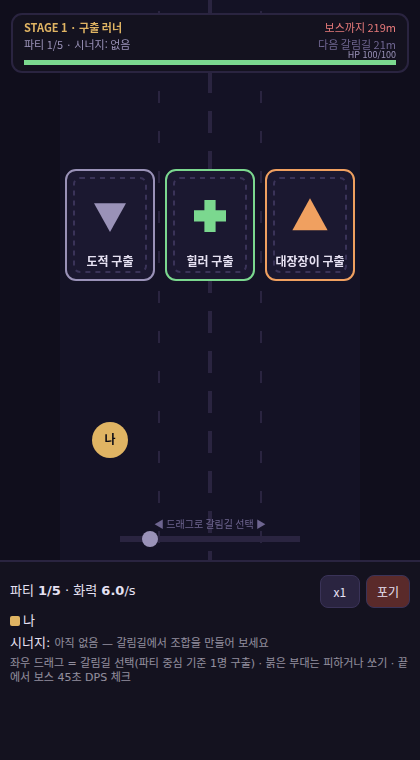 | Rescue Run 구출 러너 — 자체 #1 (구상안 A) | 자체 (Phase 2 구상안 A, Sage 2026-09-11) | 구출 러너 · 파티 시너지 · 보스 DPS 체크 | 58/58 |
| 11 | 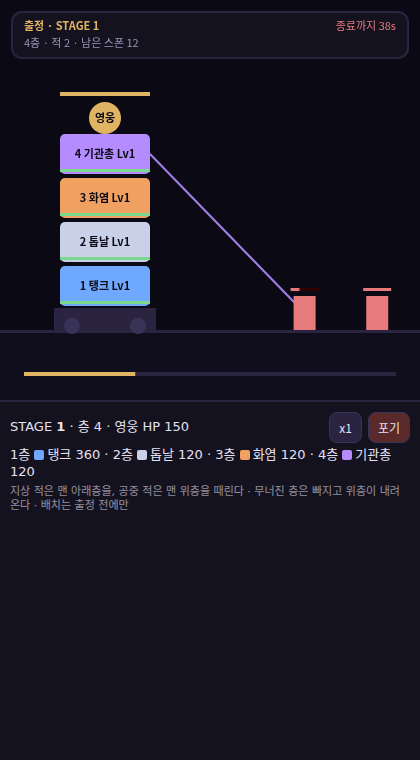 | Layer Town 층탑 마을 — 자체 #2 (구상안 C) | 자체 (Phase 2 구상안 C, Sage 2026-09-11) | 층 순서 퍼즐 TD · 난민 마을 · 시간 게이트 | 57/57 |
| 12 | 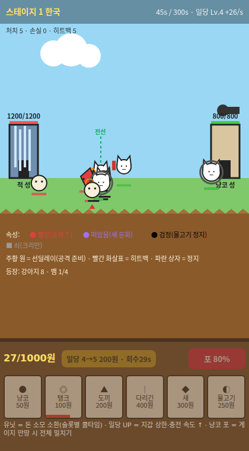 | 로직 연구 #12 | 냥코 대전쟁 The Battle Cats (PONOS) | 횡스크롤 타워 디펜스 · 실시간 경제 · 히트백 | 64/64 |
| 13 | 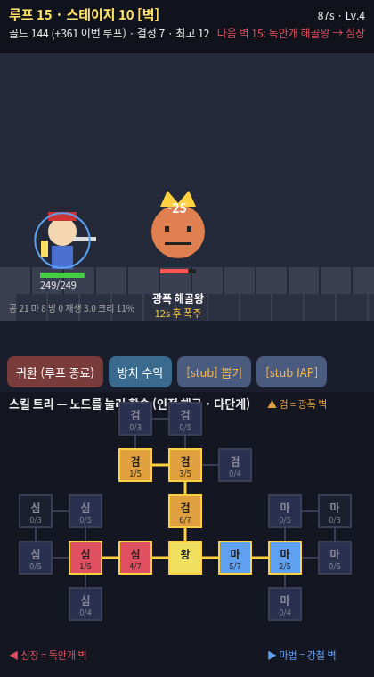 | 로직 연구 #13 | Loop King - 방치형 RPG (Sugarscone) | 방치형 RPG · 루프 · 노드 스킬 트리 | 45/45 |
| 14 | 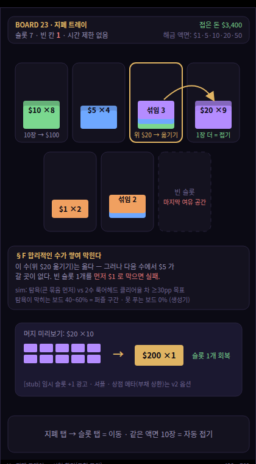 | 캐주얼 MVP 구상 G–K — 2026 하이브리드 캐주얼 5종 (사전조사 + 구상) | Smash Fest · Money Sort · Pixel Flow · Food Hunt · Bus Traffic Fever (2026 하이브리드 캐주얼) | 캐주얼 구상 G–K |  |
| 15 | 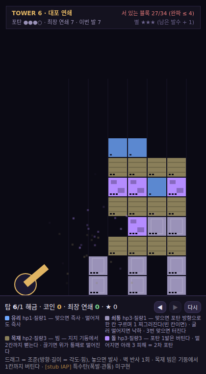 | 로직 연구 #15 | Smash Fest (물리 파괴 퍼즐) — 격자 지지 규칙으로 축소 | 캐주얼 · 물리 연쇄 | 36/36 |
| 16 | 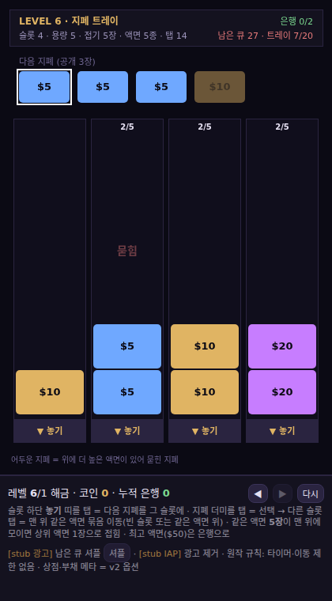 | 로직 연구 #16 | Money Sort: Merge Puzzle (Loop Games, 2026-03) — 정렬·머지 | 캐주얼 · 공간 압박·머지 | 30/30 |
| 17 | 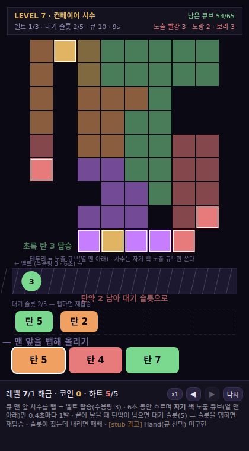 | 로직 연구 #17 | Pixel Flow! (Loom Games) — 컨베이어 색 사격·슬롯 | 캐주얼 · 흐름·타이밍 (슬롯 계열) | 28/28 |
| 18 | 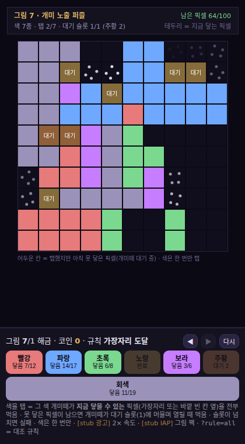 | 로직 연구 #18 | Food Hunt: Pixel Puzzle (EVERFUN) — 개미 색 소비·순서 | 캐주얼 · 노출 순서 (슬롯 계열) | 27/27 |
| 19 | 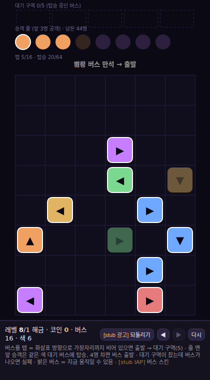 | 로직 연구 #19 | Bus Traffic Fever! (구 Bus Rush Fever) — 방향 막힘·승객 색 | 캐주얼 · 방향 해제 (슬롯 계열) | 25/25 |
| 20 |  | Lantern Harbor 등불 항구 (hook_game A · 자체 상업 라인) | 자체 (Bus Jam / Parking Jam 계열 + 바람 카드) — arrow_buses #19 뼈대 | 캐주얼 · 방향 해제 (슬롯 계열) · 상업 | 29/29 |
| 21 |  | Wandering Keep 걷는 성 (hook_game B · greybox) | 자체 (layer_town #11 층 순서 + rescue_run 1:1 카운터 + battle_cats 지갑 + kingshot 난민) | 층 순서 퍼즐 TD · 상업 후보 | 36/36 |
| 22 | 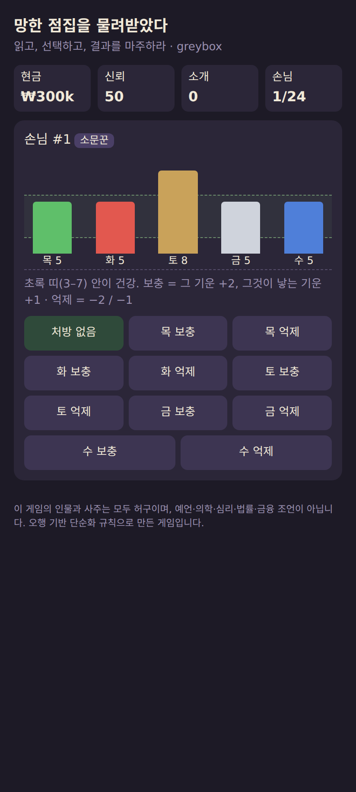 | 망한 점집을 물려받았다 (paid_chart · greybox) | 자체 (paid_chart spec v1) | 사주 경영 시뮬 · 유료 차트 후보 (iOS) | 20/20 |

## 3. 엔진 프로젝트

| 이름 | 플랫폼 | 한 줄 | 상태 |
|---|---|---|---|
| Brinkfall | Roblox | 체크포인트 없는 탑 오르기. 한 발 잘못 디디면 처음부터 (One Wrong Step 계열) | 공개 |
| Gloamrun | Roblox | 90초 탈출. 시계에서 미로를 생성하고(출구 = 최단 경로가 55~72%), 커서 모양 추격자 | 비공개 테스트 |
| Ruinstack | Roblox | Call the Fall. 발파 위치를 설계해 잔해를 줄무늬 구역에 떨어뜨림 | 비공개 테스트 |
| Limpshot | Roblox | 부상 상태 FPS. 버티고 서 있으면 다친 채로 움직일 때보다 정확함 | 비공개 테스트 |
| Devour (가제) | Roblox | 삼키는 입 키우기(.io 계열). 빨강 = 나를 먹는 쪽, 초록 = 내가 먹는 쪽, 커질수록 카메라가 물러남 | 빌드 완료 · 미게시 |
| Roblox 타이쿤 | Roblox | 큐브 도감형 타이쿤 | 빌드 완료 · 미게시 |
| Wayward Ember | 웹 캔버스 | 영웅 존재감 파일럿 (허브 · 소환 · 탐험 전투) | 파일럿 |
| Hearthkeep | Godot | 낮엔 마을을 키우고 밤엔 지키는 픽셀 생존 경영 (Kingdom Two Crowns · Thronefall 계열). 저장/오프라인 진행까지 구현 | 08-30 이후 진행 없음 |
| snake_survivor | Godot | 스네이크 × 서바이버. 동료 열차 + 원정 메타 | 보류 |
| mvp_apps 8종 | 웹 | 몽글 3종 · 보스 역할 RPG · 리듬 RPG · 케어 타이쿤 등 | 보류 |

## 4. 디자인 시안 (게임 관련)

내부 디자인 랩의 게임 관련 시안 목록입니다. 원본 HTML은 내부 랩에 있고, 여기에는 제목만 적습니다.

**hook_game — 훅이 확실한 상업 MVP 1개 (시안 → 빌드)** (1)

- 09-26 · 훅 게임 MVP 시안 r1 — 3안 (등불 항구 · 걷는 성 · 픽셀 피크닉) — 검토 중

**게임 시안 — 앱 · Roblox 후보** (1)

- 10-09 · 게임 시안 2026-10 — 앱 2 (오행 정리 · 밤의 점집) · Roblox 2 (이상현상 점집 · 걷는 성 협동) — 검토 중

**Roblox — 타이쿤 완성도 시안 · Route B 신규 아이템 시안** (6)

- 09-17 · MVP 완성도 시안 3종 (A 살아있는 공장 · B 큐브 도감 · C 주문 보드) + 공통 바닥 — 결정
- 09-20 · 썸네일 · 아이콘 3차 후보 (합성: 배경 플레이트 + 그린 키 마스코트) — 검토 중
- 09-22 · Route B 시안 6종 — 3초 훅 프레임 + 테스트 실행 링크 4개 — 결정
- 09-24 · Devour(가제 Last Mouth) — 삼자회의 → Sage 판정 → 빌드 (Planning Model 룩 · 클립 2 · 아이콘 · 썸네일) — 검토 중
- 09-24 · Gloamrun 디자인 1차 — 파격 시안 3종 (Blueprint Error · Sundown · Teeth Garden) — 검토 중
- 09-24 · Ruinstack — Call the Fall (삼자회의 → Sage 판정 → v5 빌드: 발파 설계형 루프 · 황혼 발파장 룩 · 클립 2 · 아이콘 · 썸네일) — 검토 중

**Brinkfall — 룩 · 아이콘 · 썸네일 시안** (2)

- 09-24 · Brinkfall 아트 디렉션 1차 — 파격 3안 (Solar Forge · Impact Department · Proof Sheet) — 결정
- 09-29 · 스토어 타일 v2 — BRINKFALL 단어 아이콘(A 검정 / B 밝음) + 썸네일 3장 (census row 1 무료 팔) — 검토 중

**로직 게임 시안 r1 — B 알케미 바스티온 · D 블롭 브롤 · A 스펠 스프린트 (C 폐기)** (5)

- 09-28 · 픽셀 재현 테스트 r1 — 완성형 이미지 vs 우리 2D 파이프라인 (B · D) — 검토 중
- 09-28 · 픽셀 테스트 r2 — 애니메이션 · 블롭 부위 분리 · 캐릭터 축소 (15gen) — 검토 중
- 09-28 · 픽셀 테스트 r3 — 타일셋 지도 (0gen) · 넓게 만들고 ×2 축소 · 네이티브 확정 — 검토 중
- 09-28 · 로직 게임 완성형 예상 화면 r1 — B · D · A (Gemini 3 Pro Image 채택) — 검토 중
- 09-28 · 로직 게임 시안 r1 — B 알케미 바스티온 · D 블롭 브롤 · A 스펠 스프린트 (C 폐기) — 검토 중

**Wayward Ember — 자체 게임 #1 (파일럿 웹 캔버스)** (1)

- 09-06 · Wayward Ember — 영웅 존재감 파일럿 (허브 · 소환 · 영웅 · 탐험 전투) — 결정

**UEFN — 포트나이트 크리에이티브 계획** (2)

- 09-19 · UEFN — 계획 (PLAN.md) — 초안
- 10-09 · ZEPETO + UEFN 전이 맵 — 58항목 2플랫폼 채점 + 교차 뷰 (ideation) — 초안

**제페토 — AI 아이템 시안** (1)

- 09-19 · 도사·무녀·도깨비 생활한복 — 6세트 방향 시안 + 상점 썸네일 멈춤 테스트 — 검토 중

**레퍼런스 모음** (2)

- 09-27 · 레퍼런스 모음 — 24개 (훅 게임 A·B · saju · Wayward Ember · Godot 흥행작 · snake_survivor) — 공개
- 10-09 · 3플랫폼 비주얼 기준 보드 — 호평작 30장 + 7규칙 + 우리 후보 견본 11장 — 결정

**에셋 팩 — 생성 카탈로그** (14)

- 09-13 · 에셋 팩 카탈로그 — 전 팩 한 화면 — 공개
- 09-30 · 09-30 생성분 — 봉건 일본 적·NPC + 한국 민속(장승 소품) — 검토 중
- 10-02 · Hero 팩 itch 상세 페이지 시안 v1 — GIF 표지 + 직업별 GIF — 검토 중
- 10-03 · Knight 비교 — Unity AI 처음부터 vs PixelLab — 검토 중
- 10-03 · Hero Unity 패키지 — 오버뷰 맵 + 검증 결과 — 검토 중
- 10-07 · Fantasy Icon Mega Pack — 10-07 fix review (18 icons, Sage picks) — 결정
- 10-07 · Fantasy Icon Mega Pack — itch page pass (Preview section: inventory, all 120 at 64 px, 32 px) — 검토 중
- 10-07 · Sidescroller Starter — itch 상세 페이지 시안 (10-07) — 검토 중
- 10-07 · Status Effect VFX — itch 상세 페이지 시안 (10-07) — 결정
- 10-07 · Survivor Monster Roster — itch 상세 페이지 시안 (10-07) — 검토 중
- 10-07 · Projectile & Buff VFX — itch 상세 페이지 시안 (10-07) — 결정
- 10-07 · Sidescroller Starter — 10-07 재생성 검수 (적용 완료) — 결정
- 10-07 · Survivor Monster Roster — 재생성 검수 (10-07) — 결정
- 10-07 · VFX 팩 재생성 검수 — Status Effect (10-07 검토 대기) · Projectile & Buff (적용 완료) — 결정

게임 외 시안(앱 화면 · 채널 · 굿즈 등) 59건은 내부 랩에만 둡니다.

## 🔗 관련 문서
- [`logic/genres.md`](../logic/genres.md): 위 MVP들의 장르별 루프와 함정
- [`logic/core_systems.md`](../logic/core_systems.md) · [`platforms/roblox/`](../platforms/roblox/) · [`platforms/godot/`](../platforms/godot/)
