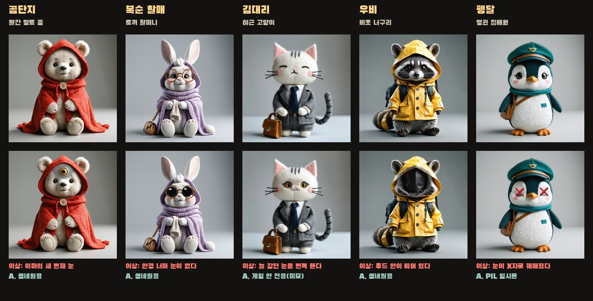
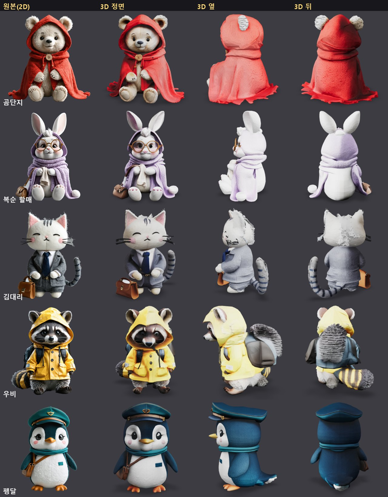
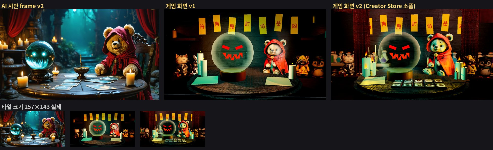

# R-A 이상현상 점집: 야간 근무 — 작업 현황

> Roblox · 호러 교대 근무 · 1~4인 · 목표 등급 Mild. 10-09 선택.
> 기준일: **2026-10-10 UTC**. 출시 일정, 수익, 계정 정보는 이 저장소에 두지 않습니다.
> 훅: *손님 중 하나는 사람이 아니다. 점을 봐 줘야 정체가 드러난다.*

| 문서 | 내용 |
|---|---|
| [`reading_spec_v1.md`](reading_spec_v1.md) | 점 보기 미니게임 기획서 v1 (도구 4+1, 향 예산, 5밤 구조, 생성 규칙, 협동, 측정, 첫 프로토 범위) |
| [`RESEARCH_REQUESTS.md`](RESEARCH_REQUESTS.md) | **AI 팀에 맡기는 조사 질문.** 질문마다 필요한 것, 이유, "찾았다"의 기준 |
| [`../../references/anomaly_shop_roblox.md`](../../references/anomaly_shop_roblox.md) | 설계 시사점 12가지, Roblox 구현 자료, 등급 정책, 만세력 라이브러리 |

## 1. 방향 (스카우팅 결론)
- 이 포맷은 2026년 Roblox 호러에서 가장 뜨거운 포맷입니다. 1위 **Animal Hospital (Anomaly)**: 동시접속 약 4.4만, 방문 24억, 등급 Minimal (10-09 Roblox API로 확인). 썸네일 = 봉제인형 환자 줄, 그중 하나만 괴물 입.
- 이미 쓰인 것 (따라 하면 복제): 봉제인형 화풍, 카운터 시점, CCTV, 부적·소금 결계, ✓/✗ 판정 UI, 돈으로 가게 업그레이드.
- **비어 있는 것 = 우리 정체성**: 점집 배경(수정구, 사주 종이, 손금, 향, 부적 벽) + **점을 봐 주는 행위가 곧 판별**. "fortune teller horror" 검색 결과 없음.
- 단서 등급: A = 겉모습(썸네일·초반), **B = 점괘가 드러냄(차별점)**, C = 엔진 연출(그림자, 두 번 등장).
- 1위의 수익 구조: 게임패스 0개, 개발자 상품 35개(9~1,980 R$: 부활, 전체 점프스케어, 탐지). 우리는 **결과가 정해진 상품만** 팝니다(기획서 결정 #8).

## 2. 손님 5명 (정상/이상 한 쌍)

곰단지 · 복순 할매 · 김대리 · 우비 · 펭달. 같은 손님이 어떤 밤엔 사람, 어떤 밤엔 이상현상. 판정 포인트는 "평소와 다른 한 곳".
- 원화: Stability Ultra (회색 배경 + 고른 조명, 조명이 텍스처에 구워지지 않게). 이상 디테일: 인페인팅(곰 세 번째 눈, 고양이 뜬 눈, 너구리 빈 후드). 인페인팅이 "틀린 디테일"을 자꾸 정상으로 고쳐 버린 두 명은 직접 그림(토끼 검은 안경알, 펭귄 X자 눈).
- 가독성: 할매·우비·펭달은 64px에서도 읽힘, 곰단지 150px, 김대리는 의도적으로 미묘.

## 3. 손님 3D (TRELLIS)

- 방법: rembg(isnet)로 투명 배경 + 구멍 메우기 → **TRELLIS** (trellis-community Hugging Face Space, MIT) → 단순화 0.97~0.99 → **1.1만~1.3만 삼각형**(Roblox 메시 상한 약 2만), 텍스처 1024², metallic 0 / roughness 1로 GLB 수정. 2026-10-10 실행 검증.
- 정면: 5명 모두 원화 캐릭터로 읽힘. 옆/뒤: 사진 한 장으로 추측한 것이라 흠 있음(김대리 뒤통수, 우비 꼬리 색 번짐, 곰단지 옆 귀).
- 메시에 **뼈대(리그)가 없습니다.** 걷기/앉기 애니메이션은 아직 해결 안 됨 → 조사 요청 R7.
- Hunyuan3D 커뮤니티 라이선스는 한국을 제외하는 것으로 보여 쓰지 않음(원문 재확인 안 함, 미검증).

## 4. 게임 화면 (Studio, Future 조명)

- 왼쪽 = AI 시안(방향 참고용, 제품 아님), 가운데 = 게임 화면 v1, 오른쪽 = **v2** (Creator Store 무료 소품: 인증 제작자, 스크립트 없음, 삼각형 제한 필터).
- 타일 크기(257×143)에서 수정구 속 붉은 얼굴은 AI 시안보다 더 잘 읽힘. Roblox 썸네일은 실제 게임 화면이어야 한다는 원칙이라 이 경로가 정식 경로.
- 남은 흠: 곰단지 털이 청록/촛불 빛을 받아 얼룩덜룩, 촛불이 플라스틱 같음, 부적 줄이 커튼에 잘림, 제목 로고 없음.
- 확인한 사실 (Studio 플러그인 하네스, 2026-10-09~10 실행): 플러그인은 `Lighting.Technology`를 못 바꿈(place 파일에서 설정) · 로컬 플러그인은 핫 리로드 안 됨(Studio 재시작 필요) · 공 모양 Part는 가장 짧은 축으로 줄어듦(수정구 속 눈은 기울인 네온 블록으로) · SurfaceGui는 벽이 바라보는 반대 면(Back)에 붙여야 보임 · Creator Store 소품은 자체 피벗 회전을 유지해야 눕지 않음.

## 5. 다음 단계
1. 점 보기 기획서 v1 검토 → 첫 프로토(1~2밤, 혼자, 도구 3개).
2. 손님 이상 변형: 정상 메시 UV 텍스처에 이상 디테일 투영 → "이상 Model" 한 쌍씩.
3. 썸네일 v3 (조명, 촛불 재질, 부적 폭, 로고) = 게임 이름이 정해진 뒤.
